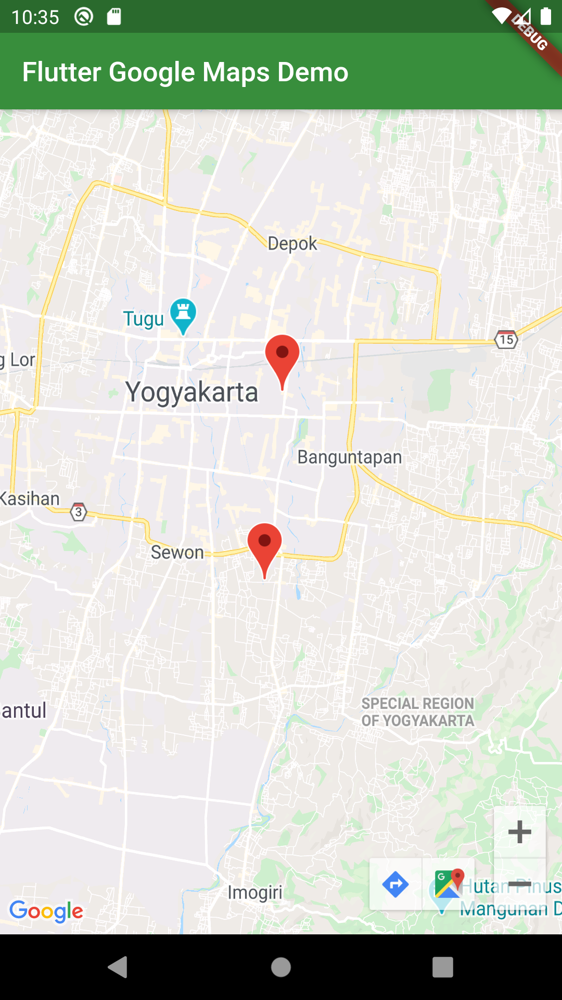

# flutter_google_maps

Flutter Google Maps Demo

## Getting Started

This project is a starting point for a Flutter application.

A few resources to get you started if this is your first Flutter project:

- [Lab: Write your first Flutter app](https://flutter.dev/docs/get-started/codelab)
- [Cookbook: Useful Flutter samples](https://flutter.dev/docs/cookbook)

For help getting started with Flutter, view our
[online documentation](https://flutter.dev/docs), which offers tutorials,
samples, guidance on mobile development, and a full API reference.

## Sample

## How to run this project

- verify flutter installed and working properly in your laptop or pc
- clone this project
- create Goole Maps API Key 
    - android : [https://developers.google.com/maps/documentation/android-sdk/get-api-key](https://developers.google.com/maps/documentation/android-sdk/get-api-key)
    - ios : [https://developers.google.com/maps/documentation/ios-sdk/get-api-key](https://developers.google.com/maps/documentation/ios-sdk/get-api-key)
- setup api key
    - android : [AndroidManifest.xml](./android/app/src/main/AndroidManifest.xml)
    - ios : [AppDelegate.swift](./ios/Runner/AppDelegate.swift)
- install dependencies `flutter pub get`
- run the app `flutter run`